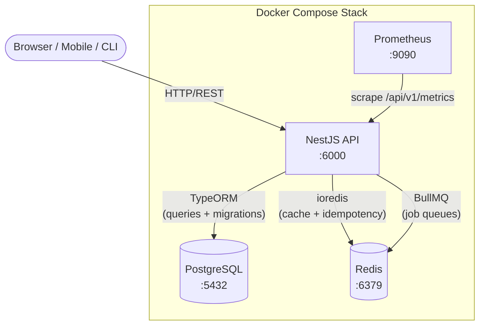
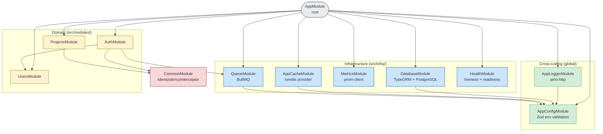
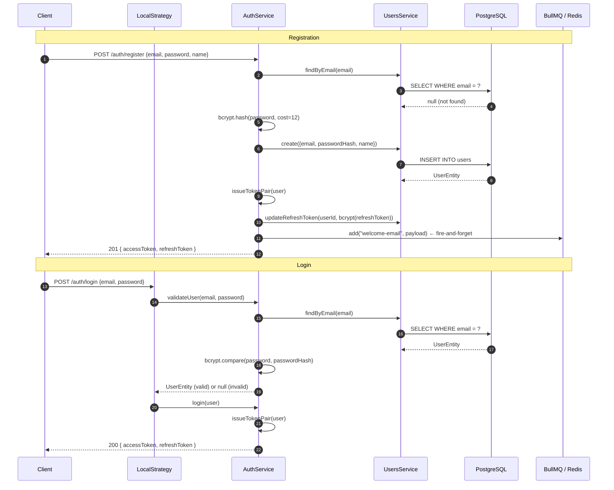
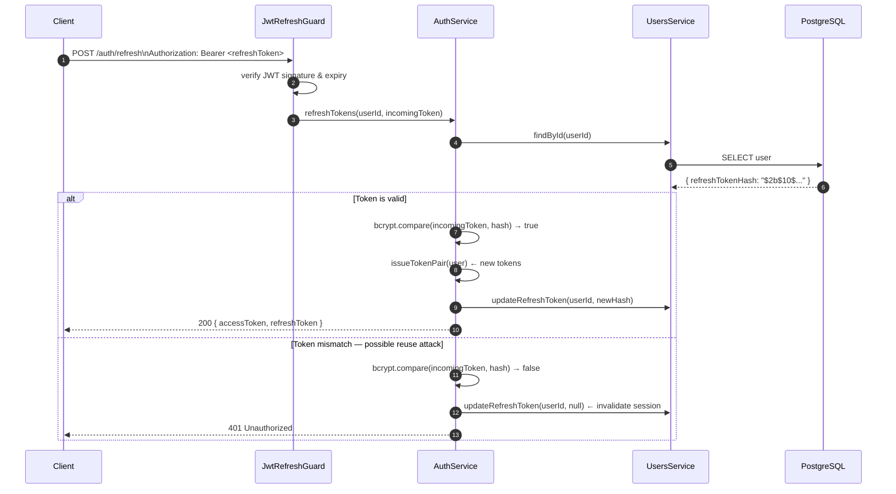
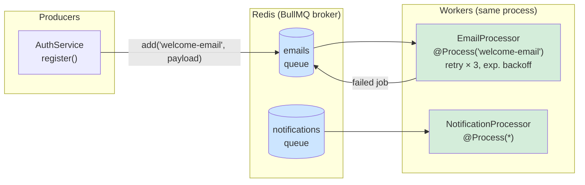
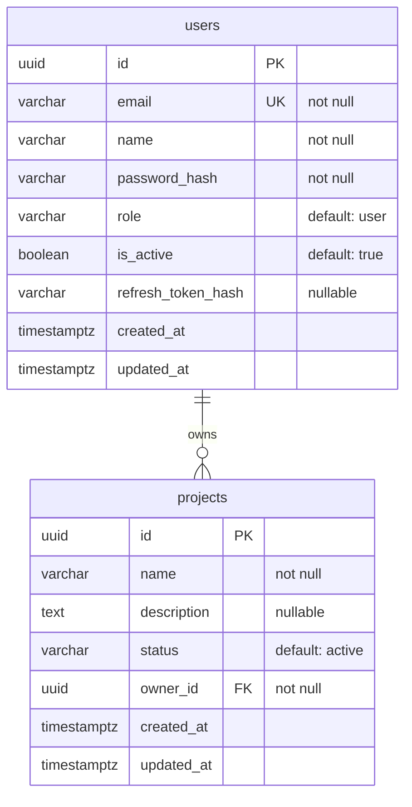
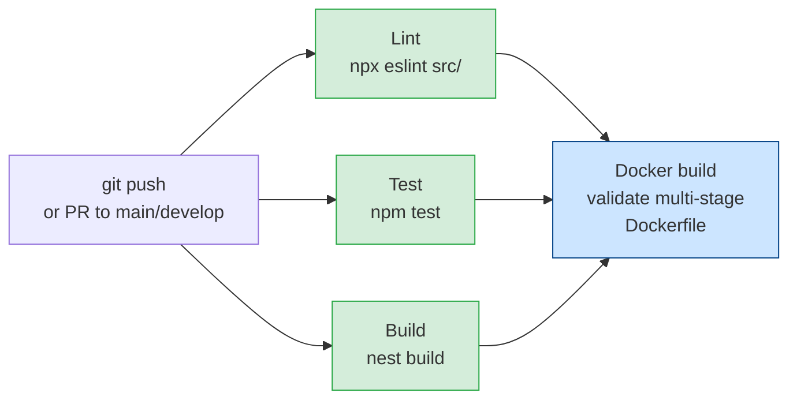

# NestJS Platform Starter

A production-oriented NestJS backend starter built to demonstrate the foundations
a Platform Engineer puts in place before feature development begins.

**Stack:** NestJS · TypeScript · PostgreSQL · Redis · TypeORM · BullMQ · JWT · Docker · GitHub Actions

---

## What this starter includes

| Concern | Implementation |
|---|---|
| Configuration | Zod-validated env schema, typed `AppConfigService`, fail-fast on startup |
| Database | TypeORM + PostgreSQL, async setup, startup retry, migration CLI |
| Cache | ioredis directly (no cache-manager), typed `AppCacheService`, exponential backoff |
| Queue | BullMQ with named queues, processor pattern, separate Redis connection |
| Authentication | JWT access tokens (15 min) + refresh tokens (7 d, rotation, reuse detection) |
| Authorization | Global `JwtAuthGuard`, `@Public()` opt-out decorator |
| Validation | `ValidationPipe` — whitelist, forbid-unknown, transform, stop-at-first-error |
| Rate limiting | `@nestjs/throttler` — default 100 req/60 s, auth routes 10 req/60 s |
| Idempotency | Redis SET NX interceptor — safe to retry POST/PATCH without side effects |
| Error handling | Global `HttpExceptionFilter`, TypeORM constraint mapping (23505 → 409) |
| Logging | pino-http, request correlation ID via `X-Request-ID`, structured JSON |
| Metrics | Prometheus-compatible `/metrics` endpoint via `prom-client` |
| Health | Liveness probe (event loop), readiness probe (DB + Redis + heap) |
| OpenAPI | Swagger UI at `/docs` (development only), full decorator coverage |
| Testing | Jest unit tests (20 tests), supertest e2e test suite |
| Code quality | Prettier, ESLint v9 flat config, Husky pre-commit, commitlint (Conventional Commits) |
| Docker | Multi-stage Dockerfile, non-root user, Compose stack with healthcheck-gated startup |
| CI | GitHub Actions — lint, test, build, Docker validation in parallel |

---

## Architecture

### System topology



---

### Request pipeline

Every incoming request passes through the following layers in order.
The outermost interceptors wrap all inner layers, ensuring metrics capture
total latency and the error filter always produces a consistent error shape.

```mermaid
flowchart LR
    HTTP["HTTP\nRequest"]

    subgraph middleware ["Middleware (runs first, every request)"]
        RID["RequestId\nMiddleware\nadds X-Request-ID"]
    end

    subgraph guards ["Guards"]
        TH["ThrottlerGuard\nrate limit"]
        JWT["JwtAuthGuard\ntoken validation\n@Public() opts out"]
    end

    subgraph pipes ["Pipes"]
        VP["ValidationPipe\nwhitelist · transform\nstop-at-first-error"]
    end

    subgraph interceptors ["Interceptors (outermost → innermost)"]
        MET["MetricsInterceptor\ntimes request"]
        TRF["TransformInterceptor\nwraps in { data, statusCode, timestamp }"]
        SER["ClassSerializerInterceptor\nstrips @Exclude() fields"]
    end

    Handler["Route Handler"]
    Filter["HttpExceptionFilter\n@Catch() — unified error shape"]
    Response["HTTP\nResponse"]

    HTTP --> RID --> TH --> JWT --> VP --> MET --> TRF --> SER --> Handler
    Handler -- "success" --> Response
    Handler -- "throws HttpException\nor runtime error" --> Filter --> Response
```



---

### Module dependency map



---

### Authentication flow — register & login



---

### Token refresh and reuse detection

Refresh tokens are rotated on every use. Presenting a token that has already been
rotated (reuse) signals a potential token theft — the session is immediately invalidated.



---

### Queue architecture



---

### Database schema



---

### CI pipeline



Concurrent runs for the same branch are automatically cancelled when a new commit
is pushed (`concurrency: cancel-in-progress`).

---

## Quick start

### Option A — Full stack in Docker

```bash
cp infra/.env.example infra/.env
docker compose -f infra/docker-compose.yml up --build
curl http://localhost:6000/api/v1/health/live
```

Or with Make:

```bash
make env && make up-build
```

### Option B — API on host, infrastructure in Docker

Best for fast iteration with hot-reload.

```bash
# 1. Start Postgres + Redis
make infra-up

# 2. First-time setup
cp apps/api/.env.example apps/api/.env
cd apps/api && npm install

# 3. Hot-reload dev server
npm run start:dev
```

One command after first-time setup:

```bash
make dev
```

### First requests

```bash
# Register
curl -s -X POST http://localhost:6000/api/v1/auth/register \
  -H "Content-Type: application/json" \
  -d '{"email":"dev@example.com","password":"P@ssword1!","name":"Dev User"}'

# Login — returns { data: { accessToken, refreshToken }, statusCode, requestId, timestamp }
TOKEN=$(curl -s -X POST http://localhost:6000/api/v1/auth/login \
  -H "Content-Type: application/json" \
  -d '{"email":"dev@example.com","password":"P@ssword1!"}' \
  | jq -r '.data.accessToken')

# Authenticated request
curl http://localhost:6000/api/v1/projects \
  -H "Authorization: Bearer $TOKEN"

# Swagger UI (development only)
open http://localhost:6000/docs
```

---

## API endpoints

All endpoints are prefixed with `/api/v1`. Protected routes require
`Authorization: Bearer <accessToken>`.

### Auth (`/auth`) — public

| Method | Path | Rate limit | Description |
|--------|------|-----------|-------------|
| `POST` | `/auth/register` | 10 req/60 s | Create account, returns token pair |
| `POST` | `/auth/login` | 10 req/60 s | Authenticate, returns token pair |
| `POST` | `/auth/logout` | default | Invalidate refresh token |
| `POST` | `/auth/refresh` | default | Rotate token pair (send refresh token as Bearer) |

### Users (`/users`) — JWT required

| Method | Path | Description |
|--------|------|-------------|
| `GET` | `/users/me` | Get own profile |
| `PATCH` | `/users/me` | Update own profile |

### Projects (`/projects`) — JWT required

| Method | Path | Description |
|--------|------|-------------|
| `POST` | `/projects` | Create project (201) |
| `GET` | `/projects` | List own projects |
| `GET` | `/projects/:id` | Get one (404 if missing, 403 if not owner) |
| `PATCH` | `/projects/:id` | Partial update (403 if not owner) |
| `DELETE` | `/projects/:id` | Delete (204, 403 if not owner) |

### Observability — public

| Method | Path | Description |
|--------|------|-------------|
| `GET` | `/health/live` | Liveness — event loop responding |
| `GET` | `/health/ready` | Readiness — DB + Redis + heap healthy |
| `GET` | `/metrics` | Prometheus metrics scrape endpoint |

---

## Project layout

```
.
├── apps/
│   └── api/                         NestJS application
│       ├── src/
│       │   ├── @types/              Express type augmentations (requestId, startTime)
│       │   ├── config/              Zod env schema, typed AppConfigService (global)
│       │   ├── common/              Cross-cutting, framework-agnostic utilities
│       │   │   ├── common.module.ts   Exports IdempotencyInterceptor for domain modules
│       │   │   ├── decorators/        @Public(), @CurrentUser()
│       │   │   ├── filters/           HttpExceptionFilter (global via APP_FILTER)
│       │   │   ├── interceptors/      MetricsInterceptor, TransformInterceptor,
│       │   │   │                       IdempotencyInterceptor
│       │   │   ├── middleware/        RequestIdMiddleware
│       │   │   └── utils/             withRetry (exponential backoff)
│       │   ├── infra/               Technical infrastructure — no business logic
│       │   │   ├── cache/             ioredis provider (REDIS_CLIENT), AppCacheService
│       │   │   ├── database/          TypeORM module, DataSource, migrations/, seeds/
│       │   │   ├── health/            Liveness + readiness probes, RedisHealthIndicator
│       │   │   ├── logger/            pino-http module
│       │   │   ├── metrics/           prom-client, MetricsService, /metrics controller
│       │   │   └── queue/             BullMQ root module, named queues, processors, job types
│       │   ├── modules/             Domain business logic
│       │   │   ├── auth/              JWT strategies, guards, full auth flow
│       │   │   ├── users/             UserEntity, profile endpoints, interfaces
│       │   │   └── projects/          CRUD reference module (template for new features)
│       │   ├── app.module.ts        Root module — global providers via APP_* tokens
│       │   └── main.ts              Bootstrap, CORS, ValidationPipe, Swagger
│       ├── test/
│       │   ├── helpers/             create-test-app.ts (mirrors bootstrap for e2e)
│       │   ├── app.e2e-spec.ts      Full e2e test suite (supertest)
│       │   └── jest-e2e.json        e2e Jest config
│       ├── Dockerfile               Multi-stage production build (node:22-alpine)
│       ├── .env.example             Host-run env template (DATABASE_HOST=localhost)
│       ├── .prettierrc.json         Prettier config (singleQuote, printWidth=100)
│       ├── commitlint.config.js     Conventional Commits enforcement
│       └── eslint.config.js         ESLint v9 flat config + eslint-config-prettier
├── .husky/
│   ├── pre-commit                   lint-staged (prettier + eslint on staged files)
│   └── commit-msg                   commitlint (Conventional Commits validation)
├── infra/
│   ├── docker-compose.yml           Full local stack (api + postgres + redis + prometheus)
│   ├── .env.example                 Docker env template (DATABASE_HOST=postgres)
│   └── postgres/
│       └── init.sql                 First-run DB init (uuid-ossp extension)
├── docs/
│   ├── architecture.md              Extended architecture notes
│   ├── new-module.md                Step-by-step guide for adding a feature module
│   └── adr/                         Architectural Decision Records
├── .github/
│   └── workflows/
│       └── ci.yml                   Lint · Test · Build · Docker validation
└── Makefile                         Developer convenience commands
```

---

## Configuration

All environment variables are validated at startup by Zod. The application
exits immediately if any required variable is missing or invalid.

Copy the appropriate template before running:

| Template | Use when |
|---|---|
| `apps/api/.env.example` | Running the API directly on your host |
| `infra/.env.example` | Running the full stack with Docker Compose |

### Variables

| Variable | Default | Description |
|---|---|---|
| `NODE_ENV` | `development` | Runtime environment (`development` \| `production` \| `test`) |
| `PORT` | `6000` | HTTP port |
| `CORS_ORIGINS` | `http://localhost:6000` | Comma-separated allowed origins |
| `DATABASE_HOST` | — | Postgres host (`localhost` or `postgres` in Docker) |
| `DATABASE_PORT` | `5432` | Postgres port |
| `DATABASE_NAME` | — | Database name |
| `DATABASE_USER` | — | Database user |
| `DATABASE_PASSWORD` | — | Database password |
| `DATABASE_SSL` | `false` | Enable TLS for the Postgres connection |
| `DATABASE_SYNCHRONIZE` | `false` | Auto-sync schema — **never `true` in production** |
| `DATABASE_LOGGING` | `false` | Log SQL queries |
| `REDIS_HOST` | `localhost` | Redis host |
| `REDIS_PORT` | `6379` | Redis port |
| `REDIS_PASSWORD` | — | Redis password (optional) |
| `REDIS_TTL` | `3600` | Default cache TTL in seconds |
| `JWT_SECRET` | — | Access token signing secret |
| `JWT_REFRESH_SECRET` | — | Refresh token signing secret (must differ from `JWT_SECRET`) |
| `JWT_ACCESS_EXPIRES_IN` | `15m` | Access token lifetime |
| `JWT_REFRESH_EXPIRES_IN` | `7d` | Refresh token lifetime |

---

## Schema management

`DATABASE_SYNCHRONIZE=true` is enabled in `infra/.env.example` for local
convenience only — TypeORM will create and alter tables automatically.

**Never use `SYNCHRONIZE=true` in production. Use migrations:**

```bash
# Generate a migration from entity changes
cd apps/api
npm run migration:generate -- src/infra/database/migrations/DescribeMigration

# Apply all pending migrations
npm run migration:run

# Roll back the most recent migration
npm run migration:revert
```

Seed local data (3 users, 4 projects):

```bash
npm run seed
# or
make seed
```

---

## Testing

```bash
# Unit tests (Jest, no infrastructure needed)
npm test
make test

# Watch mode
npm run test:watch

# Coverage report
npm run test:cov

# e2e tests (requires running Postgres + Redis)
make infra-up
npm run test:e2e
make test-e2e
```

The `test/helpers/create-test-app.ts` bootstraps the full NestJS application
for e2e tests using the same configuration as `main.ts`, so the behaviour is
identical to production.

---

## Code quality

### Formatting

Prettier is configured in `apps/api/.prettierrc.json` (`singleQuote`, `trailingComma: all`, `printWidth: 100`).

```bash
# Auto-format all source files
npm run format
make format

# Check formatting without writing (used in CI)
npm run format:check
```

### Linting

ESLint v9 flat config in `apps/api/eslint.config.js`. Prettier is integrated via
`eslint-config-prettier` so the two tools never conflict.

```bash
npm run lint
make lint   # runs ESLint + prettier --check
```

### Pre-commit hooks

[Husky](https://typicode.github.io/husky/) runs two hooks on every commit:

| Hook | What it does |
|------|-------------|
| `pre-commit` | `lint-staged` — runs `prettier --write` + `eslint --fix` on staged `.ts` files only |
| `commit-msg` | `commitlint` — enforces [Conventional Commits](https://www.conventionalcommits.org/) format |

#### Conventional Commits — quick reference

```
<type>[optional scope]: <description>

feat:     a new feature
fix:      a bug fix
chore:    maintenance / dependency updates
refactor: code change that is not a fix or feature
test:     adding or updating tests
docs:     documentation only
perf:     performance improvement
ci:       CI/CD changes
```

Examples:
```bash
git commit -m "feat(auth): add email verification on register"
git commit -m "fix(projects): return 404 when project is soft-deleted"
git commit -m "chore: upgrade nestjs to v10.4"
```

Hooks are installed automatically when you run `npm install` via the `prepare` script.

---

## Make targets

```bash
make help           # list all targets with descriptions

make env            # copy .env templates (first-time setup)
make dev            # start infra + API with hot-reload
make infra-up       # start Postgres + Redis only
make up-build       # build and start the full Docker stack

make install        # npm ci
make build          # nest build (TypeScript compile)
make test           # unit tests
make test-e2e       # e2e tests (starts infra first)
make lint           # ESLint + prettier check
make format         # auto-format with Prettier

make migrate        # run pending migrations
make migrate-revert # revert the last migration
make seed           # seed development data

make logs           # follow all container logs
make logs-api       # follow API container logs only
make prometheus     # open Prometheus UI in the browser
make docs           # open Swagger UI in the browser
make reset          # docker compose down -v (drops volumes)
```

---

## Adding a new module

The `projects` module is the reference implementation. See
[docs/new-module.md](docs/new-module.md) for a concrete step-by-step walkthrough.

In summary:

1. Create `src/modules/<name>/` with `entity`, `dto/`, `service`, `controller`, `module`
2. Import `CommonModule` in your module to get `IdempotencyInterceptor`
3. Register your module in `AppModule`
4. Add `TypeOrmModule.forFeature([YourEntity])` to your module imports
5. Generate a migration: `npm run migration:generate -- src/infra/database/migrations/AddYourEntity`

---

## Roadmap

Foundation is complete. Natural next extensions:

- **Pagination** — `page` / `limit` query params with `findAndCount` on list endpoints
- **Role-based access control** — `RolesGuard` + `@Roles()` decorator on top of the existing `UserRole` enum
- **Multi-device sessions** — dedicated `refresh_tokens` table keyed by `(userId, tokenFamily)` instead of a single hash on the user row
- **Email verification** — token-based verify-on-register flow; queue infrastructure is already wired
- **Deploy workflow** — `deploy.yml` triggered on `main` push, pushes image to a container registry
- **Redis Throttler storage** — swap the in-memory throttler store for `ThrottlerStorageRedisService` for multi-replica deployments
